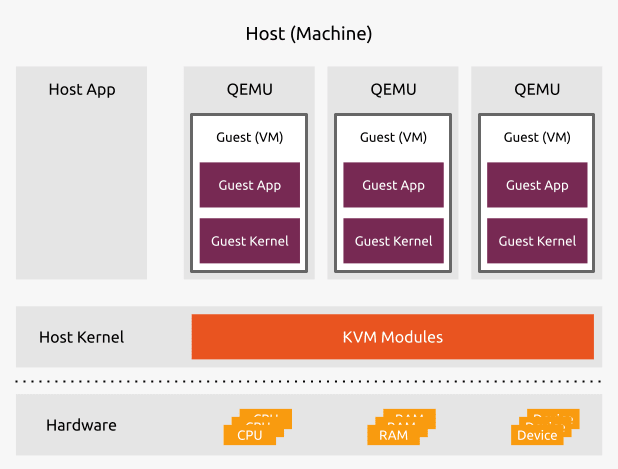

# Kernel-From-Scratch

A kernel developed from scratch without relying on any existing software, APIs, or frameworks.


## Table of Contents

1. [Project Overview](#project-overview)
2. [Setup](#setup)
   - [KVM](#kvm)
   - [Cross-Compiler](#cross-compiler)
3. [Kernel Essentials](#kernel-essentials)
   - [Entry Point (`boot.s`)](#entry-point-boots)
   - [Kernel Code (`kernel.c` and `terminal.c`)](#kernel-code-kernelc-and-terminalc)
   - [Linker Script (`linker.ld`)](#linker-script-linkerld)
   - [Configuration (`grub.cfg`)](#configuration-grubcfg)
4. [Compilation and Running](#compilation-and-running)

## Project Overview

This project demonstrates the development of a basic x86 kernel. It includes setting up the bootloader, initializing the terminal, and printing text to the screen. The kernel is built using a cross-compiler and runs on a virtual machine using QEMU.

## Setup

### KVM

**KVM** ([Kernel-based Virtual Machine](https://ubuntu.com/blog/kvm-hyphervisor)) is a leading open-source virtualization technology for Linux. It allows physical servers to host multiple, isolated virtual machines (VMs).



#### Dependencies Installation

Install the necessary dependencies with the following command:

```bash
sudo apt-get install -y bridge-utils cpu-checker libvirt-clients libvirt-daemon qemu qemu-kvm xorriso mtools
```

#### Check for Virtualization Support

Ensure your system supports KVM by running:

```bash
kvm-ok
# Successful output:
# INFO: /dev/kvm exists
# KVM acceleration can be used
```

### Cross-Compiler

A **Cross-Compiler** is required to compile the kernel as the host and target systems may differ. Follow the [cross-compiler setup instructions](../xcompiler/README.md).


## Kernel Essentials

### Entry Point (`boot.s`)

The `boot.s` file is the initial assembly code that sets up the processor environment and provides the entry point for the kernel.

```assembly
/* Declare constants for the multiboot header. */
...
```

### Kernel Code (`kernel.c` and `terminal.c`)

- **`kernel.c`**: Contains the main kernel routines including terminal initialization and text display functions.

```c
#include "kernel.h"
...
void kernel_main(void) {
    t_terminal terminal;
    terminal_init(&terminal);
    terminal_putstr("42", &terminal);
}
```

- **`terminal.c`**: Provides functions to handle terminal operations such as printing characters and strings.

```c
#include "kernel.h"
...
void terminal_putstr(const char *data, t_terminal *terminal) {
    size_t i = 0;
    while (data[i]) {
        terminal_putchar(data[i++], terminal);
    }
}
```

### Linker Script (`linker.ld`)

The `linker.ld` script specifies how the various sections of the kernel should be linked together.

```ld
/* Example linker script */
SECTIONS {
    . = 0x100000;
    .text : { *(.text) }
    .rodata : { *(.rodata) }
    .data : { *(.data) }
    .bss : { *(.bss) }
}
```

### Configuration (`grub.cfg`)

The `grub.cfg` file configures GRUB to load the kernel.

```cfg
menuentry "kernel-from-scratch" {
    multiboot /boot/kernel.bin
}
```

## Compilation and Running

### Requirements

- An ix86-elf cross-compiler.

### Steps

1. **Compile the Kernel**:
   Ensure your project structure matches the required directory setup:
   ```
   ├── boot
   │   └── boot.s
   ├── grub
   │   └── grub.cfg
   ├── include
   │   └── kernel.h
   ├── kernel
   │   ├── kernel.c
   │   └── terminal.c
   ├── linker
   │   └── linker.ld
   ├── Makefile
   └── obj
   ```

   Then run the following command to compile the kernel and create the ISO:

   ```bash
   ./build.sh
   ```

2. **Clean Build Artifacts**:
   To clean the object files, kernel binary, and ISO, run:

   ```bash
   ./build.sh fclean
   ```

3. **Run the Kernel**:
   Use QEMU to boot the kernel:

   ```bash
   qemu-system-i386 -cdrom kernel.iso
   # Or
   ./run.sh
   ```
